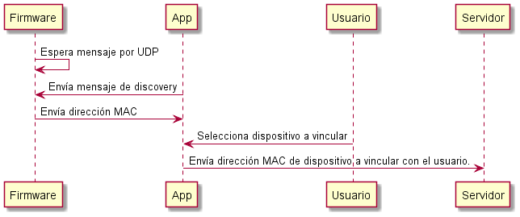
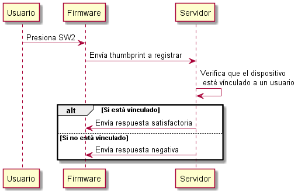
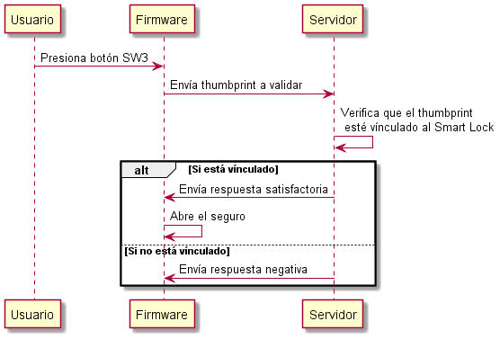

# Reporte proyecto final

## Descripción de proyectos
---
### SmartLock.Firmware
En este proyecto se encuentra toda la implementación respecto a la tarjeta K64F. Se está utilizando FreeRTOS para el sistema operativo y LwIP para la librería de IP, además del cliente de MQTT.

### 
SmartLock.Web

Implementación del servidor que procesa los mensajes que llegan a través del servidor de MQTT. Además de una pequeña REST API para la vinculación del _Smart Lock_ con el usuario que lo utilizará.

### SmartLock.Mobile
Implementación de aplicación móvil multiplataforma para hacer la vinculación del Smart.Lock con el usuario.

### SmartLock.Mobile.Android y SmartLock.Mobile.iOS
Proyectos _host_ para cada plataforma. Se utiliza para que se pueda compilar cada proyecto en la plataforma correspondiente y entregar un paquete individual a cada plataforma.

## Funcionamiento general
--- 

### Proceso de vinculación
Para que un _thumbprint_ pueda ser registrado, el _Smart Lock_ como tal debe ser vinculado a un usuario, para esto se usa el siguiente proceso.

### Proceso de registro
Al presionar el botón SW3, el firmware envía un mensaje a través de MQTT pidiendo el registro del _thumbprint_, entonces el servidor verifica que el _Smart Lock_ esté vinculado, si así es, entonces se registra el _thumbprint_ a ese _Smart Lock_.

### Proceso de autenticación
Al presionar el botón SW2, el firmware envía en mensaje a través de MQTT pidiendo la validación del _thumbprint_, entonces el servidor verifica que el _thumbprint_ esté registrado con ese _Smart Lock_, si así es, abre el seguro, que es simulado moviendo un servo, de lo contrario, no mueve el servo.

## Tareas de FreeRTOS
---

### auth_task
Esta tarea espera a recibir un evento desde alguno de los botones, ya sea una petición de autenticación o una de registro. Dependiendo de que botón se presionó, es la petición que envía a través de una cola a la tarea _mqtt_send_task_.

### discovery_task
Esta tarea espera un mensaje por el puerto 1002 de UDP, este mensaje debe ser una letra 'd', esta identifica al mensaje como un mensaje para descubrir dispositivos en la red. Al recibir este mensaje, el dispositivo envía de vuelta un paquete a quien envió el inicial con la dirección MAC del dispositivo.

### servo_action_task
Esta tarea espera un evento, el evento indica que se debe abrir el seguro.

### init_mqtt_tasks
Esta tarea crea a otras dos, _mqtt_send_task_ y _mqtt_receive_task_.

### mqtt_send_task
Esta tarea espera en una cola el mensaje que tiene que convertir a texto y enviar a través de la cola de MQTT.

### mqtt_receive_task
Esta tarea inicia el proceso de espera de mensajes de MQTT en la cola de recepción.

## Acerca MQTT
Es un protocolo de comunicación basado en colas, los dispositivos se registran a recibir mensajes en la cola que sea de su interés, en el caso de la implementación que se realizó, el dispositivo se subscribe la cola con el formato "devices/[dirección mac]/r00". Para enviar mensajes, no es necesario subscribirse a la cola, basta con indicar a que cola se enviará, en este caso, la ruta de la cola donde se publican los mensajes es "devices/[dirección mac]", de este modo, cada dispositivo puede ser identificado individualmente a costa de tener dos colas por cada dispositivo.
